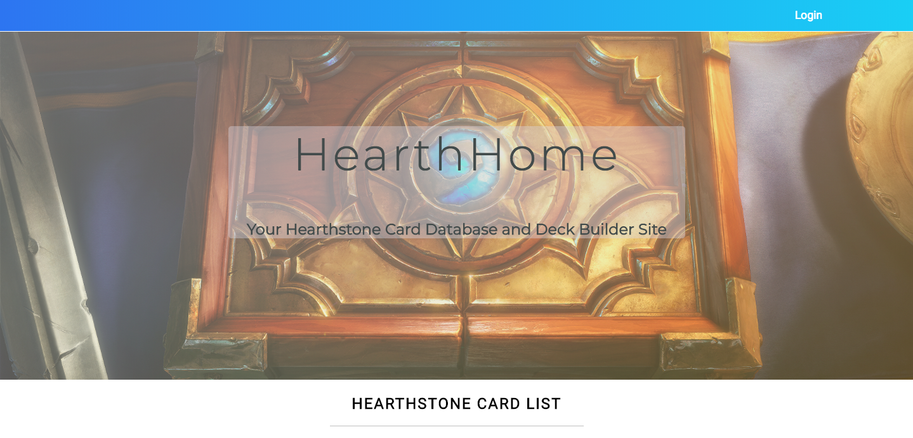

## HearthHome Description

- HearthHome is a card database and deck builder site for the popular digital card game, Hearthstone.  HearthHome is a one page app designed to make it easy on users to quickly switch back and forth between wanting to view and filter the latest Hearthstone cards and to build out their own decks.  

## Link to Deployed App

- You can view the live app at https://adoring-bardeen-d90d59.netlify.com/ 

## Tech Stack

* Front End: React.js & Redux, CSS3
* Back End: Node.js, Express.js, REST API endpoints, MongoDB, Mongoose, Passport, bcryptjs
* Workflow: Git, Github, Heroku, Netlify, NPM, Yarn, Trello
* Testing: Enzyme for React

## React/Redux App Structure

* This app focuses heavily around the React/Redux architecture of working with state globally, available to all components as needed.  It uses the pattern of dispatching actions -> update reducer -> update store & state -> props available back in the components throughout the app.  App.js is the parent component rendering important child components such as the filter-section component, deck-builder component, grid-list component, and saved-decks component.  These components have further rendering & props importance.

## Screenshots

- Header 

- Main View

- Filter Section First View

- Filter Section Select Class View

- Filter Section Select Class View

- Saved Decks Section

## Graphic Attributions

Hearthstone Card Images 
- Hearthstoneapi.com

Wallpaper: 
- Wallpaperscraft.com
- https://wallpaperscraft.com/image/hearthstone_heroes_of_warcraft_box_sword_smoke_pattern_95366_1920x1080.jpg

Hero Images
- Hearthstone Wiki: https://hearthstone.gamepedia.com/Hearthstone_Wiki
- Ex: https://d1u5p3l4wpay3k.cloudfront.net/hearthstone_gamepedia/3/3c/Jaina_Proudmoore%28320%29.png

Class & Neutral Small Icon Images 
- Metastats.net
- Ex: http://metastats.net/images/class/neutral.png

